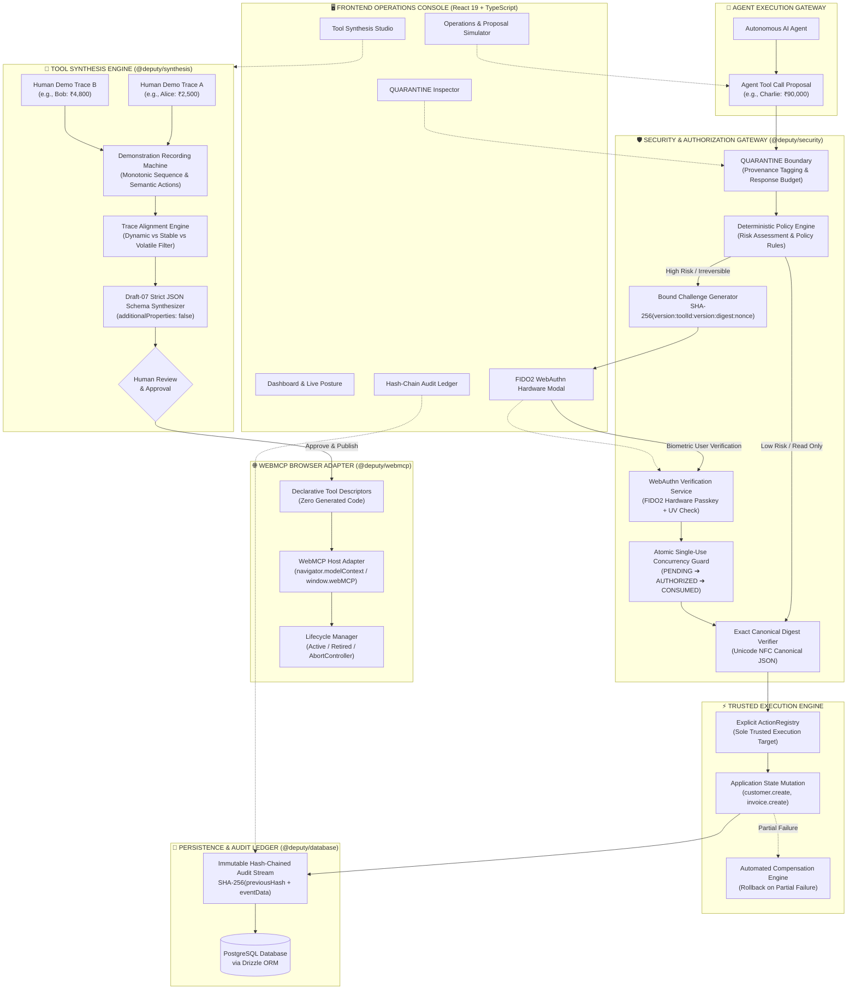
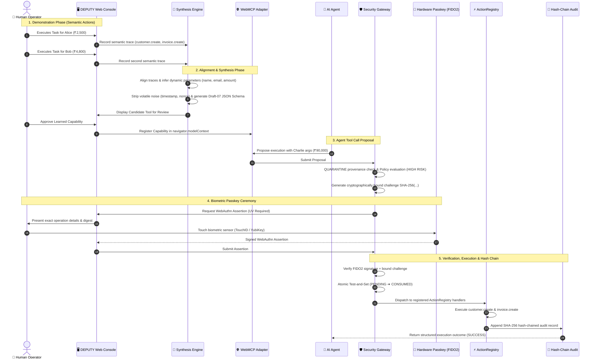
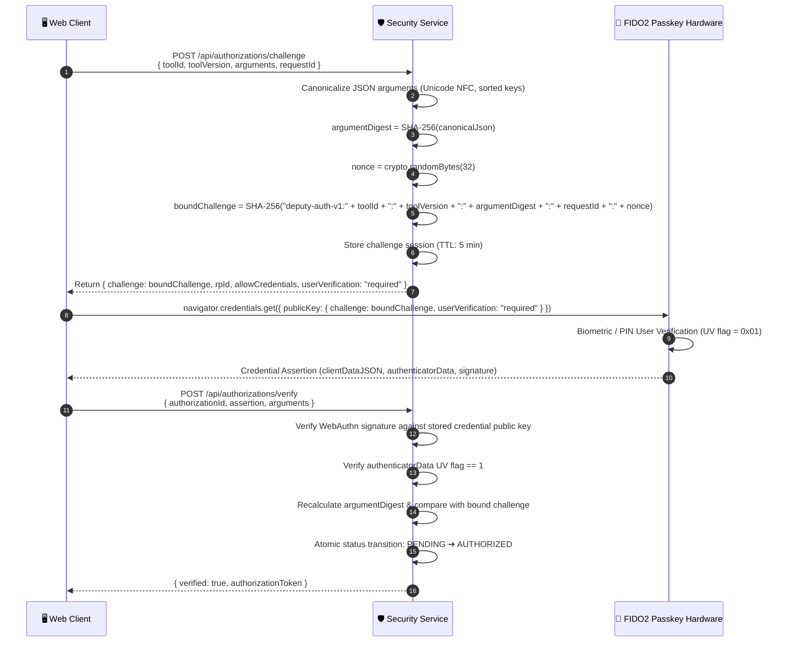
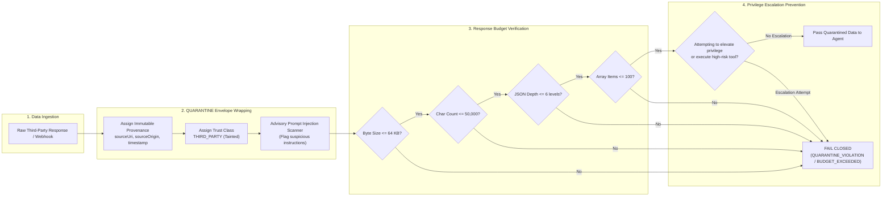

# DEPUTY

<div align="center">

```
  ██████╗  ███████╗ ██████╗  ██╗   ██╗ ████████╗ ██╗   ██╗
  ██╔══██╗ ██╔════╝ ██╔══██╗ ██║   ██║ ╚══██╔══╝ ╚██╗ ██╔╝
  ██║  ██║ █████╗   ██████╔╝ ██║   ██║    ██║     ╚████╔╝
  ██║  ██║ ██╔══╝   ██╔═══╝  ██║   ██║    ██║      ╚██╔╝
  ██████╔╝ ███████╗ ██║      ╚██████╔╝    ██║       ██║
  ╚═════╝  ╚══════╝ ╚═╝       ╚═════╝     ╚═╝       ╚═╝
```

### **WebMCP-Native Learning & Hardware-Verified Authorization Platform for Autonomous AI Agents**

[](https://github.com/priteshvirat24/Deputy/actions/workflows/ci.yml)
[](https://github.com/priteshvirat24/Deputy)
[-3178c6.svg?style=flat-square>)](https://www.typescriptlang.org/)
[](https://github.com/priteshvirat24/Deputy)
[-6366f1.svg?style=flat-square>)](https://w3c.github.io/webauthn/)
[](docs/security-invariants.md)
[](https://orm.drizzle.team/)
[](LICENSE)

<p align="center">
  <a href="#1-the-deputy-paradigm">The Paradigm</a> •
  <a href="#2-system-architecture">Architecture</a> •
  <a href="#3-core-sequence-flows">Sequence Flows</a> •
  <a href="#4-the-37-security-invariants">37 Invariants</a> •
  <a href="#5-adversarial-threat-model--matrix">Threat Matrix</a> •
  <a href="#6-canonical-demo-walkthrough">Alice ➔ Bob ➔ Charlie Demo</a> •
  <a href="#7-monorepo-structure">Monorepo</a> •
  <a href="#8-api--protocol-reference">API Reference</a> •
  <a href="#9-quickstart--local-development">Quickstart</a>
</p>

</div>

---

## 1. The DEPUTY Paradigm

Traditional AI agent tooling suffers from two critical security vulnerabilities:

1. **Fragile, unverified automation**: Agents rely on fragile DOM scraping or generated scripts with full system privileges.
2. **The Confused Deputy Problem**: Agents act on unvetted LLM instructions, executing destructive operations without cryptographically verifiable human proof-of-intent.

**DEPUTY completely solves this by decoupling tool synthesis from tool execution:**

> **A human demonstrates a task twice. DEPUTY automatically analyzes the traces, identifies dynamic parameters versus stable constants, strips volatile metadata, and synthesizes a typed WebMCP tool with strict JSON Schema. When an AI agent proposes using that tool, dangerous operations are cryptographically blocked until authorized by a human via a biometric FIDO2/WebAuthn hardware passkey.**

```
DEMONSTRATE  ──>  COMPARE  ──>  SYNTHESIZE  ──>  REVIEW  ──>  APPROVE  ──>  REGISTER
                                                                                │
                                                                                ▼
AUDIT (HASH CHAIN)  <──  EXECUTE  <──  PASSKEY (UV)  <──  POLICY CHECK  <──  AGENT PROPOSES
```

### The Dual Architecture Boundary

```text
┌────────────────────────────────────────────────────────────────────────────────────────┐
│ 1. LEARNING BOUNDARY (Tool Synthesis Pipeline)                                         │
│    Human Demonstrations ➔ Semantic Action Traces ➔ Deterministic Trace Alignment       │
│    ➔ Parameter Inference ➔ Strict JSON Schema ➔ Human Review ➔ WebMCP Dynamic Tool    │
└──────────────────────────────────────────┬─────────────────────────────────────────────┘
                                           │ Dynamic Capability Registration
┌──────────────────────────────────────────▼─────────────────────────────────────────────┐
│ 2. EXECUTION BOUNDARY (Security & Gatekeeper Pipeline)                                 │
│    Agent Proposal ➔ QUARANTINE Boundary ➔ Policy Engine ➔ FIDO2 WebAuthn Passkey (UV) │
│    ➔ Exact SHA-256 Digest Match ➔ Atomic Single-Use Guard ➔ Trusted ActionRegistry    │
│    ➔ Cryptographic Hash-Chained Audit Ledger                                           │
└────────────────────────────────────────────────────────────────────────────────────────┘
```

---

## 2. System Architecture

DEPUTY enforces a zero-trust, deterministic boundary between AI agents and application state.



---

## 3. Core Sequence Flows

### Sequence A: End-to-End Task Demonstration, Synthesis & WebAuthn Execution



---

### Sequence B: Cryptographic WebAuthn Bound Challenge Protocol



---

### Sequence C: QUARANTINE Content Boundary & Taint Preservation



---

## 4. The 37 Security Invariants

DEPUTY's architecture is grounded in **37 formally verified security invariants**, tested continuously under adversarial conditions.

|   #    | Invariant                           | Description                                                                                                                                             | Enforcement Point         |
| :----: | :---------------------------------- | :------------------------------------------------------------------------------------------------------------------------------------------------------ | :------------------------ |
| **1**  | **No DOM Macros**                   | Canonical learned capabilities are always strongly-typed semantic application actions (`customer.create`), never fragile DOM clicks or pixel selectors. | `@deputy/synthesis`       |
| **2**  | **Explicit ActionRegistry**         | Learned tools invoke only pre-registered, audited application actions. No dynamic execution pathways exist.                                             | `@deputy/security`        |
| **3**  | **Registration != Authorization**   | Publishing a tool descriptor to WebMCP informs the agent of a capability, but never grants execution authority.                                         | `@deputy/webmcp`          |
| **4**  | **Exact Argument Binding**          | Human authorization is cryptographically bound to the SHA-256 digest of canonicalized JSON arguments.                                                   | `WebAuthnService`         |
| **5**  | **Tool ID & Version Binding**       | Authorization for `toolA@v1` cannot authorize `toolA@v2` or `toolB`.                                                                                    | `ToolExecutor`            |
| **6**  | **Single-Use Consumption**          | Authorizations transition atomically from `PENDING` ➔ `AUTHORIZED` ➔ `CONSUMED`. Replays fail closed.                                                   | `AuthorizationRepository` |
| **7**  | **Hardware WebAuthn UV**            | High-risk and irreversible capabilities require User Verification (`UV=required`) backed by physical biometric/PIN authenticators.                      | `WebAuthnService`         |
| **8**  | **Fail-Closed Defaults**            | Unknown tools, expired nonces, altered digests, or malformed payloads fail closed with immediate execution abort.                                       | `ExecutionGate`           |
| **9**  | **Inactive Tools Cannot Execute**   | Only `ACTIVE` tools can execute. Tools in `DRAFT`, `DISABLED`, `RETIRED`, or `DELETED` status fail closed.                                              | `ToolRepository`          |
| **10** | **Immutable Audit Independence**    | Tool deletion never deletes historical audit records. The audit stream is strictly append-only.                                                         | `AuditRepository`         |
| **11** | **No Code Execution**               | No `eval()`, `new Function()`, shell commands, or generated scripts are permitted anywhere in synthesis or execution.                                   | `Synthesizer`             |
| **12** | **Deny-by-Default Origin Policy**   | Strict `new URL(origin).origin` host equality prevents subdomain/prefix hijacking (`example.com.evil`).                                                 | `OriginValidator`         |
| **13** | **QUARANTINE Content Boundary**     | External data carries immutable `ProvenanceRecord` and `TrustClass: THIRD_PARTY`. Tainted data cannot elevate authority.                                | `QuarantineBoundary`      |
| **14** | **WebMCP Retirement Propagation**   | Retiring a tool immediately aborts in-flight execution signals via `AbortController` and emits a `toolchange` event.                                    | `WebMcpAdapter`           |
| **15** | **Atomic Concurrency Protection**   | Distributed test-and-set locking prevents double-spend race conditions across parallel agent workers.                                                   | `DrizzleAuthRepo`         |
| **16** | **WebMCP Host Grace**               | Absence of browser `navigator.modelContext` falls back gracefully without crashing or degrading core security.                                          | `WebMcpAdapter`           |
| **17** | **ActionRegistry Sole Target**      | `ActionRegistry` is the one and only execution target. There are no secondary, sidecar, or backdoor runners.                                            | `ToolExecutor`            |
| **18** | **Deterministic Boundary**          | No security decision relies on an LLM classifier. Prompt injection heuristics are strictly advisory; crypto is authoritative.                           | `PolicyEngine`            |
| **19** | **Unicode NFC Canonicalization**    | Argument canonicalization normalizes Unicode strings to NFC form before computing SHA-256 hashes.                                                       | `CanonicalJson`           |
| **20** | **Prototype Pollution Immunity**    | JSON canonicalization explicitly discards `__proto__`, `constructor`, and `prototype` keys.                                                             | `CanonicalJson`           |
| **21** | **Temporal Expiration**             | Authorization challenges expire after a strict 5-minute TTL.                                                                                            | `WebAuthnService`         |
| **22** | **Cryptographic Hash Chaining**     | Audit stream links every event via `currentHash = SHA-256(previousHash + eventData)`.                                                                   | `AuditRepository`         |
| **23** | **Tamper-Evident Verification**     | `verifyIntegrity()` detects any modified, inserted, reordered, or deleted audit row.                                                                    | `AuditRepository`         |
| **24** | **Advisory Prompt Injection Flags** | Heuristic scanners flag suspicious instruction sequences without compromising deterministic security rules.                                             | `QuarantineBoundary`      |
| **25** | **Data Taint Preservation**         | Transforming or slicing quarantined envelopes preserves the source trust class across all operations.                                                   | `QuarantineBoundary`      |
| **26** | **Response Byte Budgeting**         | Responses exceeding 64 KB fail closed with `RESPONSE_QUARANTINED` to prevent buffer overflows.                                                          | `QuarantineBoundary`      |
| **27** | **Response Depth Limiting**         | JSON nesting exceeding 6 levels fails closed before parsing.                                                                                            | `QuarantineBoundary`      |
| **28** | **Declarative Dataflow Validation** | Multi-step composite workflows validate that parameter references (`$steps.0.customerId`) are acyclic and valid statically.                             | `CompositeExecutor`       |
| **29** | **Automated Compensation**          | Partial failures in composite transactions trigger reverse compensation actions (`customer.delete`).                                                    | `CompositeExecutor`       |
| **30** | **Explicit Outcome Reporting**      | Executions report explicit statuses: `SUCCESS`, `NO_EFFECT`, `PARTIAL_EFFECT`, `COMPENSATED`, or `COMPENSATION_FAILED`.                                 | `ExecutionDomain`         |
| **31** | **Production Environment Contract** | Server rejects in-memory mock repositories in production mode unless `ALLOW_IN_MEMORY_DEV=true` is set explicitly.                                      | `ConfigValidator`         |
| **32** | **Production Secret Enforcement**   | Rejects insecure development default session keys and secrets when running in production.                                                               | `ConfigValidator`         |
| **33** | **Route-Sensitive Rate Limiting**   | High-security endpoints (WebAuthn ceremonies, executions) enforce strict per-IP and per-token quotas.                                                   | `RateLimiter`             |
| **34** | **Mutation Idempotency**            | `Idempotency-Key` headers cache mutation outcomes for 10 minutes, preventing duplicate remote side effects.                                             | `IdempotencyGuard`        |
| **35** | **Body Size Protection**            | Rejects HTTP request bodies exceeding 1 MB with HTTP 413 Payload Too Large.                                                                             | `ServerMiddleware`        |
| **36** | **Strict CORS Security**            | Rejects wildcard origins with credentials; enforces strict matching against configured `ALLOWED_ORIGINS`.                                               | `CorsMiddleware`          |
| **37** | **Liveness & Deep Readiness**       | `/api/readiness` performs live database table checks before accepting production traffic.                                                               | `ReadinessRoute`          |

---

## 5. Adversarial Threat Model & Matrix

DEPUTY includes a comprehensive adversarial test suite (`tests/canonical-attacks-a-h.test.ts` and `tests/adversarial-canonical.test.ts`) validating resilience against the 8 primary AI agent attack vectors:

```
┌─────────────────────────────────────────────────────────────────────────────────────────┐
│                              ADVERSARIAL ATTACK MATRIX                                  │
├────────┬─────────────────────────────┬─────────────────────────────────┬────────────────┤
│ Attack │ Vector Description          │ Architectural Defense Mechanism │ Verified Suite │
├────────┼─────────────────────────────┼─────────────────────────────────┼────────────────┤
│   A    │ Parameter Tampering         │ SHA-256 Bound Challenge Digest  │ Attacks A-H    │
│   B    │ Tool / Version Substitution │ Scoped Challenge Binding        │ Invariants 1-18│
│   C    │ Authorization Replay        │ Single-Use Atomic State Guard   │ Invariants 6,15│
│   D    │ Concurrency Race Attack     │ Database Test-and-Set Locking   │ Concurrency    │
│   E    │ Prompt Injection in Data    │ QUARANTINE Boundary Envelope    │ Quarantine     │
│   F    │ Origin Prefix Spoofing      │ WHATWG URL.origin Matching      │ Origin Security│
│   G    │ Stale / Retired Execution   │ Lifecycle AbortController       │ WebMCP Lifecycle│
│   H    │ Arbitrary Code Execution    │ Strict ActionRegistry Closure   │ Tool Synthesis │
└────────┴─────────────────────────────┴─────────────────────────────────┴────────────────┘
```

### Deep Dive: Parameter Tampering Defense (Attack A)

An attacker intercepts an approved proposal for ₹2,500 and attempts to mutate the payload to ₹90,000 before execution:

1. Operator authorized: `argumentDigest = SHA-256('{"amount":2500,"customerId":"cust_123"}')`
2. Attacker transmits: `{"amount": 90000, "customerId": "cust_123"}`
3. `ToolExecutor` recomputes `SHA-256(canonicalJson(incomingPayload))`
4. Digest mismatch: `c9b... != a14...` ➔ **Execution immediately fails closed with `ARGUMENT_DIGEST_MISMATCH`**.

---

## 6. Canonical Demo Walkthrough

The repository includes the complete canonical demonstration workflow (`Alice` ➔ `Bob` ➔ `Charlie`):

```
┌───────────────────────────────────────────────────────────────────────────────────────┐
│ DEMO 1: Alice Task               DEMO 2: Bob Task               PROPOSAL: Charlie     │
│ ├─ Customer: "Alice Smith"       ├─ Customer: "Bob Jones"       ├─ Customer: Charlie  │
│ ├─ Email: alice@acme.com         ├─ Email: bob@initech.com      ├─ Email: c@evil.com  │
│ └─ Amount: ₹2,500                └─ Amount: ₹4,800              └─ Amount: ₹90,000    │
│        │                                │                                │            │
│        └───────────────┬────────────────┘                                │            │
│                        ▼                                                 ▼            │
│             SYNTHESIS STUDIO                                    SECURITY GATEKEEPER   │
│             - Dynamic: name, email, amount                      - Risk: HIGH (>₹5,000)│
│             - Fixed: currency = "INR"                           - UV Passkey Prompt   │
│             - Strict Draft-07 JSON Schema                       - Biometric Gesture   │
│             - Human Approves Capability                         - Verified & Executed │
└───────────────────────────────────────────────────────────────────────────────────────┘
```

1. **Demonstration 1 (Alice)**: Operator creates customer `"Alice Smith"` (`alice@acme.com`) with invoice `₹2,500`.
2. **Demonstration 2 (Bob)**: Operator creates customer `"Bob Jones"` (`bob@initech.com`) with invoice `₹4,800`.
3. **Trace Alignment**: Synthesis engine aligns the two execution traces:
   - Identifies dynamic fields: `name`, `email`, `amount`
   - Identifies invariant constants: `currency = "INR"`, `taxRate = 0.18`
   - Filters volatile metadata: `timestamp`, `nonce`, `requestId`
   - Emits draft-07 JSON Schema with `additionalProperties: false`.
4. **Capability Approval**: Operator inspects the synthesized schema and approves publication to `navigator.modelContext`.
5. **Agent Proposal (Charlie)**: AI Agent proposes an invoice for `"Charlie Brown"` for `₹90,000`.
6. **Policy Gate & Passkey Ceremony**: The policy engine flags `₹90,000 > ₹5,000` as `HIGH_RISK` requiring hardware verification. The operator authenticates via TouchID/YubiKey, cryptographically signing the bound argument digest.
7. **Execution & Audit**: The tool executes within `ActionRegistry` and commits an immutable event to the hash-chained audit ledger.

---

## 7. Monorepo Structure

```text
Deputy/
├── apps/
│   ├── web/                    # React 19 + TypeScript + Vite Operations Console
│   │   ├── src/pages/          # Dashboard, OperationsConsole, SynthesisStudio, ToolsView,
│   │   │                       # AuthorizationCenter, QuarantineView, AuditView, WebMcpView
│   │   ├── src/components/     # PasskeyAuthModal, CapabilityDrawer, DemonstrationDrawer,
│   │   │                       # RecordingBar, Sidebar, TopBar, CommandPalette (Cmd+K)
│   │   └── src/styles/         # High-density security console design system (Vanilla CSS)
│   │
│   └── server/                 # Production Hono HTTP Server
│       ├── src/routes/         # Tools, Demonstrations, Authorizations, Executions, Audit, Readiness
│       └── src/middleware/     # Rate limiting, Idempotency, Body size limit, Origin CORS
│
├── packages/
│   ├── domain/                 # Core domain models (Demonstration, LearnedTool, Authorization, Audit)
│   ├── schemas/                # Zod runtime schemas & validation contracts
│   ├── synthesis/              # Trace alignment machine, parameter inference & JSON schema generator
│   ├── webmcp/                 # Native browser WebMCP adapter (navigator.modelContext) & abort signals
│   ├── security/               # WebAuthn FIDO2 service, QUARANTINE boundary & execution gatekeeper
│   ├── database/               # Drizzle ORM PostgreSQL schema, SQL migrations & atomic repo guards
│   └── config/                 # Strict environment contracts & security constants
│
├── tests/                      # 175 Unit, Integration, Adversarial & Invariant Tests (100% Passing)
│   ├── canonical-attacks-a-h.test.ts       # Authoritative Attacks Matrix (Attacks A-H)
│   ├── deputy-security-invariants.test.ts  # Full 37 Security Invariants Verification
│   ├── composite-transaction.test.ts       # Transactions, declarative dataflow & compensation
│   ├── canonicalization-audit.test.ts      # Unicode NFC, key sorting & prototype pollution
│   ├── origin-security.test.ts             # WHATWG origin parsing & prefix attack defenses
│   ├── webmcp-failure-modes.test.ts        # WebMCP lifecycle & abort signal propagation
│   └── e2e/deputy-flow.spec.ts             # End-to-end Playwright browser test with virtual passkey
│
└── docs/                       # In-depth architectural records & specifications
    ├── architecture.md         # Full system architecture specification
    ├── security-invariants.md  # 37 security invariants documentation
    ├── threat-model.md         # Adversarial threat model & attack matrix
    ├── final-demo.md           # Step-by-step Alice-Bob-Charlie runbook
    ├── quarantine.md           # QUARANTINE boundary specification
    ├── webmcp-integration.md   # WebMCP protocol binding specification
    └── production-readiness.md # Deployment topology & operations guide
```

---

## 8. API & Protocol Reference

### REST Endpoints

| Method | Endpoint                        | Description                                                | Auth Required |
| :----- | :------------------------------ | :--------------------------------------------------------- | :-----------: |
| `GET`  | `/api/health`                   | Service health status                                      |      No       |
| `GET`  | `/api/readiness`                | Deep database connectivity and readiness check             |      No       |
| `GET`  | `/api/tools`                    | List all active and learned capabilities                   |      No       |
| `POST` | `/api/tools`                    | Register a new synthesized capability                      |      Yes      |
| `POST` | `/api/demonstrations`           | Record a semantic task demonstration trace                 |      No       |
| `POST` | `/api/synthesis/align`          | Run deterministic trace alignment & parameter inference    |      No       |
| `POST` | `/api/proposals`                | Agent proposes a tool execution                            |      No       |
| `POST` | `/api/authorizations/challenge` | Generate cryptographically bound WebAuthn challenge        |      No       |
| `POST` | `/api/authorizations/verify`    | Verify FIDO2 passkey signature & issue authorization       |   Yes (UV)    |
| `POST` | `/api/executions`               | Execute capability via `ActionRegistry` (Single-use token) |      Yes      |
| `GET`  | `/api/audit`                    | Query append-only audit event stream                       |      No       |
| `GET`  | `/api/audit/integrity`          | Verify cryptographic SHA-256 hash-chain integrity          |      No       |

---

## 9. Quickstart & Local Development

### Prerequisites

- **Node.js**: `v20.0.0` or higher (Node 22 LTS recommended)
- **pnpm**: `v9.0.0` or higher
- **PostgreSQL**: `v15+` (or run via included Docker Compose)

### 1. Installation

```bash
# Clone the repository
git clone https://github.com/priteshvirat24/Deputy.git
cd Deputy

# Install dependencies across all workspace packages
pnpm install

# Configure environment variables
cp .env.example .env
```

### 2. Database Setup & Migrations

```bash
# Start PostgreSQL via Docker Compose
docker compose up -d

# Run Drizzle database migrations
pnpm db:push

# Verify database connectivity
pnpm db:check
```

### 3. Start Development Servers

```bash
# Starts Hono backend on :4000 and React Web Console on :5173
pnpm dev
```

Visit **`http://localhost:5173`** to access the DEPUTY Operations Console.

---

## 10. Verification & Quality Gates

All 7 quality gates run in CI and must pass before any merge:

```bash
# 1. Typecheck all packages (0 errors)
pnpm typecheck

# 2. Lint check (0 errors, 0 warnings)
pnpm lint

# 3. Format check
pnpm format:check

# 4. Run all 175 Vitest unit, integration & adversarial tests
pnpm test

# 5. Build production bundles for all packages and web app
pnpm build

# 6. Database schema & connectivity verification
pnpm db:check

# 7. End-to-end Playwright test suite (with virtual WebAuthn authenticator)
pnpm test:e2e
```

---

<div align="center">

**Built with cryptographic precision by the DEPUTY Core Security Team.**  
_Protecting humans, agents, and applications at the execution boundary._

</div>
