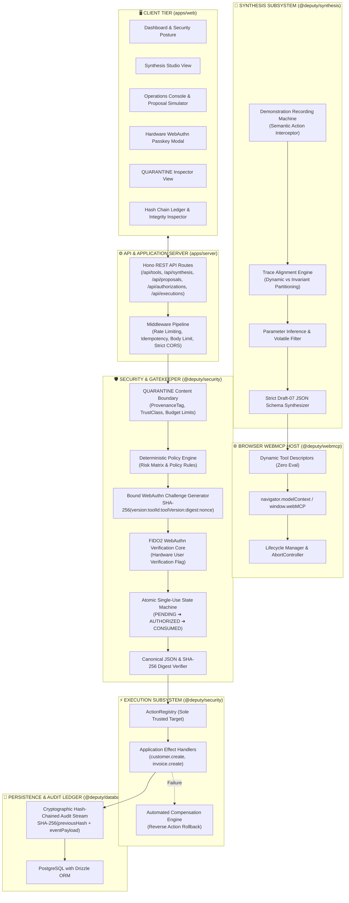
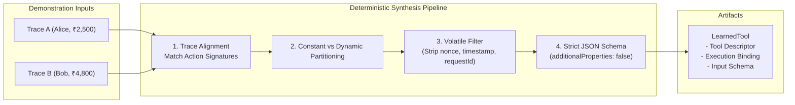
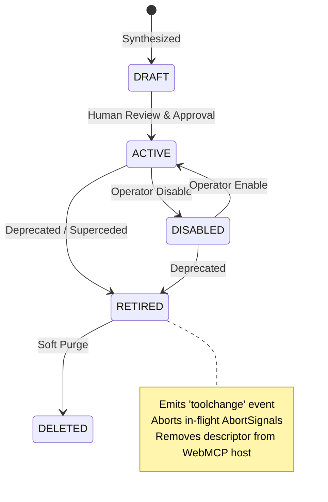
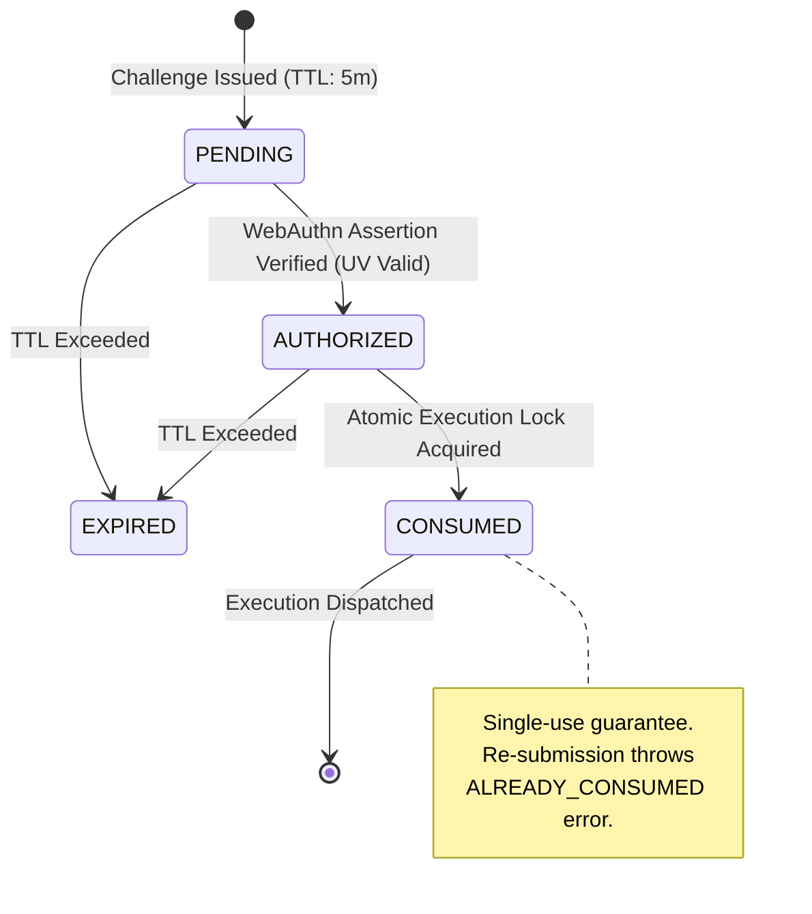
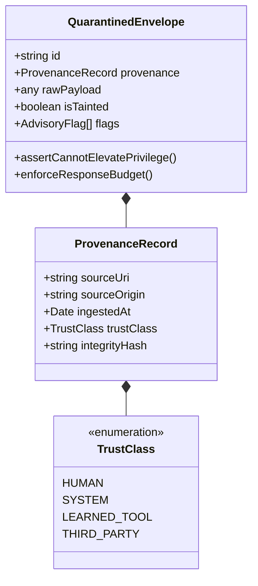
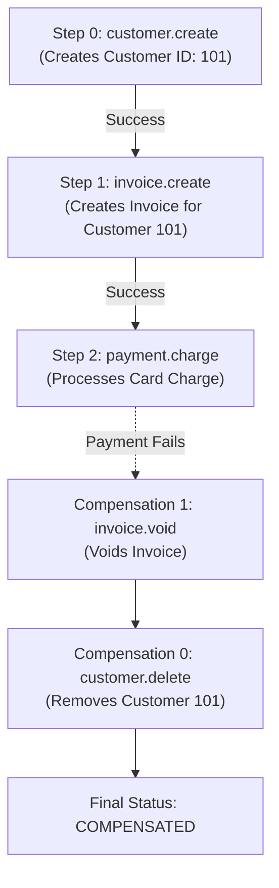
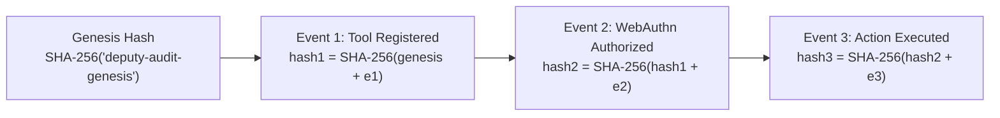

# DEPUTY System Architecture & Technical Specification

## 1. Executive Architecture Overview

DEPUTY is a WebMCP-native platform that converts human task demonstrations into typed, parameterized agent capabilities while cryptographically ensuring that high-risk actions require explicit human authorization backed by hardware passkeys (FIDO2 WebAuthn User Verification).

---

## 2. Core Architectural Subsystems

### Subsystem 1: Demonstration Recording & Alignment (`@deputy/synthesis`)

1. **Semantic Command Interception**: Intercepts typed application commands (`customer.create`, `invoice.create`) rather than fragile pixel coordinates or CSS selectors.
2. **Monotonic Sequencing**: Enforces strict ordering (`sequenceNumber === lastSequenceNumber + 1`) and idempotent duplicate rejection.
3. **Deterministic Alignment Engine**: Aligns 2+ demonstration traces, distinguishes variable inputs from stable constants, filters volatile metadata (`timestamp`, `requestId`, `nonce`), and generates strict draft-07 JSON Schema.

---

### Subsystem 2: WebMCP Dynamic Browser Adapter (`@deputy/webmcp`)

1. **Zero Generated Code**: Generates declarative descriptors with execution closures dispatching strictly into the secure gatekeeper.
2. **Host Integration**: Binds dynamically to `navigator.modelContext` or `window.webMCP`.
3. **Lifecycle Retirement**: De-registers retired capabilities, triggers in-flight execution cancellation via `AbortController`, and dispatches `toolchange` broadcast notifications.

---

### Subsystem 3: Hardware WebAuthn Passkey Authorization (`@deputy/security`)

1. **Cryptographically Bound Challenge**:
   $$\text{boundChallenge} = \text{SHA-256}(\text{"deputy-auth-v1:"} + \text{toolId} + \text{":"} + \text{toolVersion} + \text{":"} + \text{argumentDigest} + \text{":"} + \text{requestId} + \text{":"} + \text{nonce})$$
2. **User Verification (UV)**: Enforces biometric or hardware PIN verification for high-risk and irreversible capabilities (`userVerification: "required"`).
3. **Single-Use Atomic Consumption**: Enforces state transition `PENDING` ➔ `AUTHORIZED` ➔ `CONSUMED` with atomic test-and-set database guards, eliminating replay and double-spend race conditions.

---

### Subsystem 4: QUARANTINE Boundary & Origin Security (`@deputy/security`)

1. **Structured Content Envelope**: All external and third-party data carries immutable provenance and taint flags (`QuarantinedContentPart`).
2. **Response Budgets**: Enforces strict byte (64 KB), character (50,000), item (100), and depth (6) limits.
3. **Origin Isolation**: Strict `new URL(origin).origin` host matching with deny-by-default cross-origin policy.

---

### Subsystem 5: Composite Transactions & Compensation (`@deputy/security`)

For multi-step compound capabilities:

1. **Declarative Dataflow Resolution**: Step outputs feed into subsequent steps using `$steps[0].outputField` syntax.
2. **Static Forward Reference & Cycle Checking**: Validates topological ordering before dispatch.
3. **Automated Reverse Compensation**: When step $K$ fails in a multi-step workflow, the engine automatically dispatches registered compensation actions for steps $K-1 \dots 0$ in reverse order.

---

### Subsystem 6: Cryptographic Hash-Chained Audit Ledger (`@deputy/database`)

The audit stream links every event via continuous SHA-256 hash chaining:
$$\text{hash}_n = \text{SHA-256}(\text{hash}_{n-1} + \text{canonicalJson}(\text{eventPayload}_n))$$

Any mutation, insertion, deletion, or reordering of historical records is immediately detected by `verifyIntegrity()`.

---

## 3. Package Topology & Responsibilities

| Package             | Path                 | Responsibilities                                                                           |
| :------------------ | :------------------- | :----------------------------------------------------------------------------------------- |
| `@deputy/domain`    | `packages/domain`    | Pure domain entities, value objects, domain events, error hierarchy                        |
| `@deputy/schemas`   | `packages/schemas`   | Zod schemas, runtime validation contracts, canonical serializers                           |
| `@deputy/synthesis` | `packages/synthesis` | Recording machine, trace aligner, parameter inference, JSON schema emitter                 |
| `@deputy/webmcp`    | `packages/webmcp`    | WebMCP adapter, navigator host bindings, abort propagation, feature detection              |
| `@deputy/security`  | `packages/security`  | WebAuthn FIDO2 service, QUARANTINE boundary, policy engine, execution gate, ActionRegistry |
| `@deputy/database`  | `packages/database`  | PostgreSQL schema, Drizzle ORM queries, migrations, atomic concurrency repositories        |
| `@deputy/config`    | `packages/config`    | Environment contract, configuration parser, security constants                             |
| `@deputy/server`    | `apps/server`        | Hono REST API server, security middleware, health diagnostics                              |
| `@deputy/web`       | `apps/web`           | React 19 + Vite frontend console, WebAuthn passkey ceremony UI, trace inspector            |
